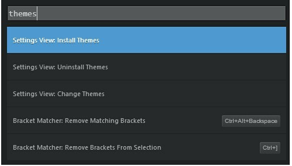
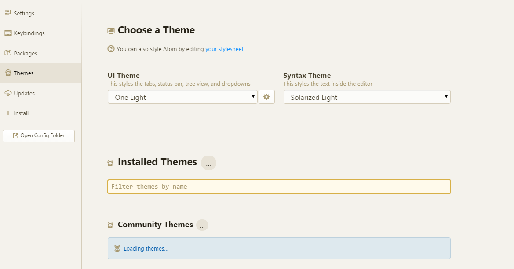

# atom编辑器的使用和markdown基本语法

## atom介绍

### atom是什么

Atom是github内部的编辑软件，据说已经使用了6年之久。

按照atom的博客：
>Our goal is a zero-compromise combination of hackability and usability: an editor that will be welcoming to an elementary school student on their first day learning to code, but also a tool they won't outgrow as they develop into seasoned hackers.
atom的优势textmate/sublime text提供了受限的扩展性；而vim/emacs扩展性很好，但编写扩展需要特定的scripting language。atom想做成一款初学者和Hacker都会喜欢，随着他们能力增长而增长的编辑器。

下载atom常用功能配置按下`Ctrl + Shift + P`可以呼出Panel对话框


在这里可以进行查找帮助信息及安装Packages或者Themes等

### 设置面板
在Sublime Text很多配置只能靠手工输入和调整。而在Atom，好像所有的设置都可以通过设置面板来更改配置，下面是设置面板的基本界面：



在这里，你可以很方便地配置如下配置项

	* 主题
	* 扩展包
	* 字体和大小
	* 行代码
	* 等等

### 修改主题
你可以在设置界面中修改 Atom 的主题，Atom 内建了 4 个不同的 UI 主题，分别是亮色和暗色版本的名为 Atom 和 One 的主题。以及 8 个不同的语法着色主题。
你可以通过点击左边栏的 Themes 选项卡来改变当前主题，或安装新的主题。



UI 主题会修改标签栏、左侧目录树（tree view）等 UI 元素的颜色；而语法着色主题修改编辑器中文字的语法高亮方案。你只需要简单地在下拉框中选择另一项，即可修改主题。

在 Atom.io 上有数十种主题供你选择，如果你想要一个独一无二的主题，我们也在 Basic Customization8 中介绍了如何自定义主题，还在 Creating a Theme4 中介绍了如何创建一个主题。

### 快捷键
Atom与Sublime Text的很多快捷键都是相同的,你可以在`Settings`查看具体的快捷键：


扩展对于Atom的Package管理来说，提供了一个内置的包管理工具，允许你扩展编辑器的功能。

这类似于Sublime的Package Control，但与之不同的时这个包管理工具以及内置在编辑器里面了，不需要另外执行一段代码来安装。

安装一个包非常简单，只需要点击Install按钮即可。编辑器还提供了搜索功能，还有一些推荐安装的包。


### 总结
以上是atom编辑器的基本介绍和一些常用功能，更多资料详见后面的参考文档。

## markdown

### 概述

>Markdown 的目标是实现「易读易写」。

Markdown 的语法全由一些符号所组成，这些符号经过精挑细选，其作用一目了然。比如：在文字两旁加上星号，看起来就像强调。Markdown 的列表看起来，嗯，就是列表。Markdown 的区块引用看起来就真的像是引用一段文字，就像你曾在电子邮件中见过的那样。
区块元素标题Markdown 支持两种标题的语法，类 Setext 和类 atx 形式。

类` Setext `形式是用底线的形式，利用 = （最高阶标题）和 - （第二阶标题），例如：

This is an H1
=============

This is an H2
-------------

任何数量的 = 和 - 都可以有效果。

类` Atx `形式则是在行首插入 1 到 6 个 # ，对应到标题 1 到 6 阶，例如：

# 这是 H1

## 这是 H2

###### 这是 H6

### 区块引用 Blockquotes
Markdown 标记区块引用是使用类似 email 中用 > 的引用方式。如果你还熟悉在 email 信件中的引言部分，你就知道怎么在 Markdown 文件中建立一个区块引用，那会看起来像是你自己先断好行，然后在每行的最前面加上 > ：

> This is a blockquote with two paragraphs. Lorem ipsum dolor sit amet,
> consectetuer adipiscing elit. Aliquam hendrerit mi posuere lectus.
> Vestibulum enim wisi, viverra nec, fringilla in, laoreet vitae, risus.
>
> Donec sit amet nisl. Aliquam semper ipsum sit amet velit. Suspendisse
> id sem consectetuer libero luctus adipiscing.

Markdown 也允许你偷懒只在整个段落的第一行最前面加上 > ：
> This is a blockquote with two paragraphs. Lorem ipsum dolor sit amet,
  consectetuer adipiscing elit. Aliquam hendrerit mi posuere lectus.
  Vestibulum enim wisi, viverra nec, fringilla in, laoreet vitae, risus.

> Donec sit amet nisl. Aliquam semper ipsum sit amet velit.
  Suspendisse id sem consectetuer libero luctus adipiscing.

区块引用可以嵌套（例如：引用内的引用），只要根据层次加上不同数量的 > ：
> This is the first level of quoting.
>
> This is nested blockquote.
>
> Back to the first level.

引用的区块内也可以使用其他的 Markdown 语法，包括标题、列表、代码区块等：
> ## 这是一个标题。
>
> 1.   这是第一行列表项。
> 2.   这是第二行列表项。
>
> 给出一些例子代码：
>
>     return shell_exec("echo $input | $markdown_script");

任何像样的文本编辑器都能轻松地建立 email 型的引用。例如在 BBEdit 中，你可以选取文字后然后从选单中选择增加引用阶层。

### 列表
Markdown 支持有序列表和无序列表。
无序列表使用星号、加号或是减号作为列表标记：

*   Red
*   Green
*   Blue

等同于：

+   Red
+   Green
+   Blue

也等同于：

-   Red
-   Green
-   Blue

有序列表则使用数字接着一个英文句点：

1.  Bird
2.  McHale
3.  Parish

如果要在列表项目内放进引用，那 `>` 就需要缩进：
*   A list item with a blockquote:

    > This is a blockquote
    > inside a list item.

### 代码区块
和程序相关的写作或是标签语言原始码通常会有已经排版好的代码区块，通常这些区块我们并不希望它以一般段落文件的方式去排版，而是照原来的样子显示，Markdown 会用 `<pre>` 和` <code>` 标签来把代码区块包起来。

要在 Markdown 中建立代码区块很简单，只要简单地缩进 4 个空格或是 1 个制表符就可以，例如，下面的输入：
这是一个普通段落：

```
    这是一个代码区块。
```
一个代码区块会一直持续到没有缩进的那一行（或是文件结尾）。

### 分隔线
你可以在一行中用三个以上的星号、减号、底线来建立一个分隔线，行内不能有其他东西。你也可以在星号或是减号中间插入空格。下面每种写法都可以建立分隔线：
* * *

***

*****

- - -

---------------------------------------

### 区段元素

#### 链接
Markdown 支持两种形式的链接语法： 行内式和参考式两种形式。
不管是哪一种，链接文字都是用 [方括号] 来标记。

要建立一个行内式的链接，只要在方块括号后面紧接着圆括号并插入网址链接即可，如果你还想要加上链接的 title 文字，只要在网址后面，用双引号把 title 文字包起来即可，例如：

This is [an example](http://example.com/ "Title") inline link.

[This link](http://example.net/) has no title attribute.

如果你是要链接到同样主机的资源，你可以使用相对路径：
See my [About](/about/) page for details.

参考式的链接是在链接文字的括号后面再接上另一个方括号，而在第二个方括号里面要填入用以辨识链接的标记：
This is [an example][id] reference-style link.

你也可以选择性地在两个方括号中间加上一个空格：
This is [an example] [id] reference-style link.

接着，在文件的任意处，你可以把这个标记的链接内容定义出来：
[id]: http://example.com/  "Optional Title Here"

下面是一个参考式链接的范例：
I get 10 times more traffic from [Google] [1] than from[Yahoo] [2] or [MSN] [3].

  [1]: http://google.com/        "Google"
  [2]: http://search.yahoo.com/  "Yahoo Search"
  [3]: http://search.msn.com/    "MSN Search"

如果改成用链接名称的方式写：
I get 10 times more traffic from [Google][] than from
[Yahoo][] or [MSN][].

  [google]: http://google.com/        "Google"
  [yahoo]:  http://search.yahoo.com/  "Yahoo Search"
  [msn]:    http://search.msn.com/    "MSN Search"

#### 强调
Markdown 使用星号（`*`）和底线（`_`）作为标记强调字词的符号，被 或 `_` 包围的字词会被转成用 标签包围，用两个 或 `_` 包起来的话，则会被转成 `<strong>`，例如：

*single asterisks*

_single underscores_

**double asterisks**

__double underscores__

#### 代码
如果要标记一小段行内代码，你可以用反引号把它包起来（`` ` ``），例如：

``Use the `printf()` function.``

如果要在代码区段内插入反引号，你可以用多个反引号来开启和结束代码区段：

``There is a literal backtick (`) here.``

代码区段的起始和结束端都可以放入一个空白，起始端后面一个，结束端前面一个，这样你就可以在区段的一开始就插入反引号：

A single backtick in a code span: `` ` ``
A backtick-delimited string in a code span: `` `foo` ``

在代码区段内，& 和尖括号都会被自动地转成 HTML 实体，这使得插入 HTML 原始码变得很容易，Markdown 会把下面这段：

Please don't use any `<blink>` tags.

你也可以这样写：

```
`&#8212;` is the decimal-encoded equivalent of `&mdash;`.
```

### 图片
很明显地，要在纯文字应用中设计一个「自然」的语法来插入图片是有一定难度的。

Markdown 使用一种和链接很相似的语法来标记图片，同样也允许两种样式： 行内式和参考式。
行内式的图片语法看起来像是：

```

```

```

```

详细叙述如下：
一个惊叹号 !

	* 接着一个方括号，里面放上图片的替代文字
	* 接着一个普通括号，里面放上图片的网址，最后还可以用引号包住并加上 选择性的 'title' 文字。

参考式的图片语法则长得像这样：

```
![Alt text][id]
```

「id」是图片参考的名称，图片参考的定义方式则和连结参考一样：

```
[id]: img/ctrl_shift_p.png  "Optional title attribute"
```

到目前为止， Markdown 还没有办法指定图片的宽高，如果你需要的话，你可以使用普通的``标签。
本地图片上传

	1. 登陆http://yotuku.cn/
	2. 上传图片，点击markdown，粘贴到markdown文档即可

## GFM

GitHub用"GitHub Flavored Markdown"，简称GFM。它广泛应用在site--in issues, comments, 以及pull requests.
它和标准的Markdown有一些区别，并添加了一些额外的功能。
与标准Markdown的区别下划线标准Markdown将含有下划线的单词转成斜体字，而GFM忽略单词中的下划线。
删除线GFM增加了删除线

```
~~Mistaken text.~~
```

显示为：
~~Mistaken text.~~

代码块如果有一整块代码需要包围， 可以使用``   ```  ``
例如：

```
x = 0
x = 2 + 2
what is x
```

语法高亮代码块可以使用语法高亮了！！在你的代码块中添加一个可选的语言标识符,我们会通过语法高亮显示运行它。例如，为了语法高亮ruby代码：

```ruby
require 'redcarpet'
markdown = Redcarpet.new("Hello World!")
puts markdown.to_html
```

Github使用Linguist来实现语言检测和语法高亮。

你可以通过阅读the languages YAML file.来获取有效的语法高亮关键字。

## 表格
你可以创建表格，通过符号-分开第一行和其他行，通过|分开各个列

First Header  | Second Header
------------- | -------------
Content Cell  | Content Cell
Content Cell  | Content Cell

在标题行包含:，你可以使得表格向左对齐，向右对齐，居中

| Left-Aligned  | Center Aligned  | Right Aligned |
| :------------ |:---------------:| -----:|
| col 3 is      | some wordy text | $1600 |
| col 2 is      | centered        |   $12 |
| zebra stripes | are neat        |    $1 |

A colon on the left-most side indicates a left-aligned column; a colon on the right-most side indicates a right-aligned column; a colon on both sides indicates a center-aligned column.

:在最左边表示左对齐，:在最右边表示右对齐，左右两边都有:表示居中。

### 总结
GFM增加了一些很好的特性， 使得功能更加强大。

## 使用atom编辑markdown文本

atom编辑器支持`markdown`文本的预览(需要安装markdown preview插件，默认已安装),编辑文本的时候，快捷键`ctrl-shift-M `即可打开`markdown preview`功能；

`markdown preview`插件信息可通过`File->Settings->Filter packages`输入框输入`markdown preview->keybindings`


参考资料atom使用参考资料
	1. [官方手册](https://atom.io/docs/)
	2. [atom china翻译的手册](http://atom-china.org/t/guan-fang-shou-ce-atom-ji-chu-shi-yong/62/1)
	3. http://jiashizhen.com/2014/09/13/6th/

markdown 语法说明
	1. [官方文档简体中文版](http://wowubuntu.com/markdown/index.html)
	2. [开始使用 Markdown](http://ued.taobao.org/blog/2012/07/getting-started-with-markdown/)
	3. [GFM](https://help.github.com/articles/github-flavored-markdown/)

一些markdown工具
	1. [强大的文本编译工具 Pandoc，支持 markdown 和 html 之间的互译](http://pandoc.org/)
	2. [Pandoc在线工具](http://pandoc.org/try/)
	3. [简书：支持markdown的博客](http://www.jianshu.com/)
